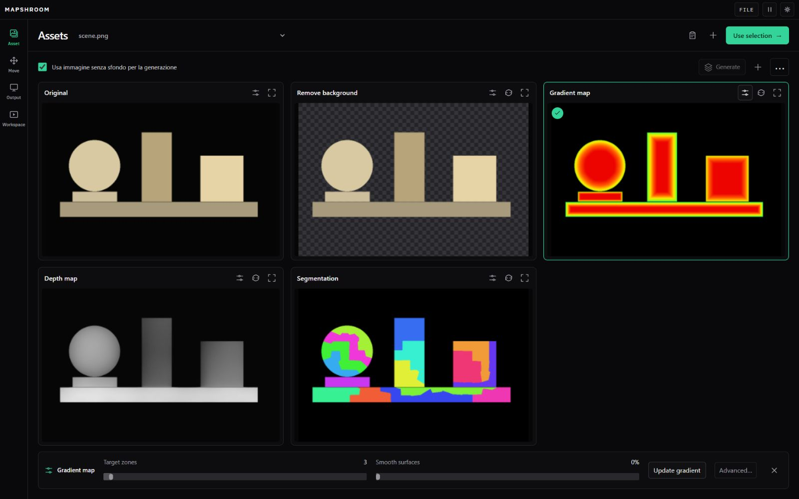

# Assets: griglia e sorgente senza sfondo

Implementazione nel ramo `codex/assets-grid-cutout`, a partire da `codex/photo-first-assets` (`aceea2d`).

## Comportamento

- Assets occupa la pagina, anche quando viene aperto come finestra sovrapposta.
- Griglia uniforme: originale in alto a sinistra, poi le quattro generazioni principali. Le altre varianti e la cronologia rimangono accessibili da “More versions”.
- Selezione con un clic e un solo comando “Use selection”. Le icone sulle schede aprono regolazioni, rigenerazione e anteprima completa.
- Le immagini restano intere e proporzionate; il motivo a scacchi segue i bordi effettivi dell’immagine senza sfondo.
- Zone e smoothing del gradient sono nel pannello richiudibile; “Advanced…” apre tutti i controlli di superfici e illuminazione. Gli editor di maschera e profondità restano disponibili.
- La guida alla posizione della fotocamera compare solo prima del caricamento.

## Preferenza di generazione

“Usa immagine senza sfondo per la generazione” viene salvata sul dispositivo insieme alle preferenze esistenti. È attiva di default; una disattivazione esplicita rimane salvata. Cambiarla non avvia elaborazioni e non sostituisce risultati già salvati.

Quando è attiva, ogni richiesta di generazione o rigenerazione usa la versione senza sfondo più recente, inclusi i ritocchi manuali. Se manca, la coda genera e salva prima quella versione. Se la creazione o il salvataggio fallisce, le elaborazioni dipendenti mostrano un errore senza ripiegare sull’originale. Le generazioni conservano il gruppo dell’originale e registrano `inputAssetId`, usato anche riaprendo l’editor depth.

## Verifiche

- Build di produzione, TypeScript e lint dei file modificati riusciti.
- `npm test`: **238 test passati**, compresi 12 nuovi test sulle preferenze e le dipendenze.
- **10 scenari browser** sulla coda reale con worker controllato: ordinamento, riuso della maschera, rigenerazione, persistenza, annullamento, richieste concorrenti, errori di elaborazione e salvataggio.
- Nell’app completa: importazione di un’immagine di prova, rimozione dello sfondo, gradient, segmentazione e depth con i worker effettivi; modifica delle zone, rigenerazione, salvataggio dall’editor avanzato e riapertura del depth editor.
- Reload del progetto: preferenza, generazioni e regolazioni conservate.
- Verifica visiva e dimensionale con formati 3:2, verticale, quadrato e panoramico 4:1; mobile a 390 px senza overflow orizzontale, con immagini allineate e della stessa dimensione.

La schermata seguente proviene dall’app locale, con una semplice immagine geometrica di prova e risultati effettivamente generati.

## Aggiornamento libreria

La navigazione tra originali ora usa miniature scorrevoli e le card sono compatte. Dettagli e screenshot in `../assets-browser-2026-09-15/README.md`.
