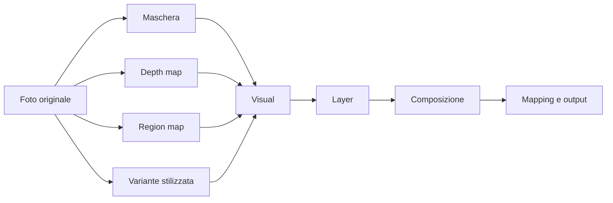

# Mapshroom V4 — inventario V3 e specifica prodotto/architettura

Stato: **Draft 0.2 — scope Web approvato**  
Data: **2026-08-09**  
Fonte di verità iniziale: codice di Mapshroom V3, documentazione del repository e documentazione tecnica ufficiale citata in fondo.

## 1. Decisione in breve

Mapshroom V4 non dovrebbe essere un clone ridotto di Resolume o TouchDesigner e non dovrebbe introdurre un node editor visibile. Dovrebbe offrire lo stesso potere utile per il projection mapping attraverso un flusso molto più corto:

**Apri/importa in Assets → scegli ruolo/varianti → sposta e mappa → crea o modifica lo shader → regola slider/tag → inserisci in layer/timeline → proietta, condividi o esporta.**

Le decisioni approvate sono:

1. **Separare Creazione e Composizione nell'interfaccia**, ma mantenerle nello stesso progetto e nella stessa applicazione.
2. Considerare una foto e le sue derivate come un'unica **Famiglia di asset**, non come file scollegati.
3. Considerare shader + ingressi + parametri iniziali come un **Visual** riutilizzabile.
4. Introdurre layer semplici e una timeline breve, senza mostrare un grafo a nodi.
5. Avere **un solo formato progetto V4**. La release corrente è **Web desktop + Web mobile**; Studio installabile Windows/macOS e mobile native restano evoluzioni future dello stesso progetto.
6. Usare una soluzione ibrida: **React/TypeScript per l'interfaccia; Rust per dominio, compiler, asset pipeline e renderer condiviso; `wgpu`/WebGPU per il nuovo motore grafico; Tauri 2 come shell installabile**.
7. Non riscrivere tutto in una cartella V4 isolata. Migrare per moduli, mantenendo V3 utilizzabile fino alla parità.
8. Rendere ogni effetto esportabile tramite **manifest + valori correnti + report di compatibilità**. Non promettere una conversione cieca e perfetta verso ogni host.
9. Non pubblicare online in questa fase: preparare e verificare la build, lasciando deployment e infrastruttura a una decisione successiva.
10. Conservare il workflow V3 e rendere dockable/personalizzabile la UI desktop, senza sacrificare il default semplice o il mirror-first mobile.

Baseline iniziale: 32 GB RAM, circa 2 GB VRAM, iPhone 15 Pro e proiettore indicato come “180p”; la risoluzione del proiettore va rilevata/confermata e non corretta per supposizione. I benchmark Web devono includere almeno 720p e 1080p e possono usare qualità adattiva esplicita.

## 2. Cosa significa “grafo” in questa specifica

Il grafo non è un'interfaccia con blocchi da collegare. È il piano interno usato dal motore per decidere l'ordine delle operazioni e non dovrebbe essere visibile all'utente.

Esempio interno:



L'utente vede una foto, un visual e pochi controlli. Il motore vede dipendenze, passaggi GPU e cache. Questa separazione permette ottimizzazioni senza trasformare Mapshroom in TouchDesigner.

## 3. Audit del repository V3

### 3.1 Dimensione e stack

Mapshroom V3 è una web app React 19, TypeScript 5.9 e Vite 8. Usa Three.js, Transformers.js, jsPDF, WebCodecs tramite `mp4-muxer`, PostHog e un deploy Cloudflare/GitHub Pages.

Il repository non è letteralmente un singolo file, ma il workspace principale è molto concentrato:

| Modulo | Dimensione rilevata | Lettura architetturale |
|---|---:|---|
| `src/routes/WorkspaceRoute.tsx` | 8.724 righe | Orchestrazione, dominio, persistenza e UI sono troppo accoppiati |
| `src/index.css` | 15.985 righe | Stili globali difficili da governare e verificare |
| `src/components/StageRenderer.tsx` | 2.464 righe | Renderer WebGL e lifecycle React nello stesso modulo |
| `src/components/TimelineStageRenderer.tsx` | 2.370 righe | Molta logica timeline/render separata ma duplicata |
| `src/components/ShaderTimelineEditor.tsx` | 1.518 righe | Editor specializzato e già complesso |
| `src/components/TimelineBar.tsx` | 1.325 righe | Seconda rappresentazione della timeline |
| `src/components/AiPanel.tsx` | 1.236 righe | Flussi e stati AI concentrati nel componente |
| `src/components/TimelineExportDialog.tsx` | 956 righe | UI, render deterministico, encoding e bundle nello stesso file |

Le librerie shader sono inoltre incorporate in grandi file TypeScript: il solo bundle importato contiene 263 definizioni; le altre collezioni aggiungono centinaia di preset. Questo aumenta dimensione del sorgente, costo di parsing e difficoltà di manutenzione.

### 3.2 Route e moduli pubblici esistenti

Sono presenti:

- workspace principale;
- route output sincronizzata per il proiettore;
- pagina download/installazione;
- privacy;
- tutorial;
- manifesto/“why”;
- guida shader;
- creator challenge;
- Mask Studio standalone e incorporato;
- Depth Map Studio standalone e incorporato;
- Slicer OBJ standalone.

Vite usa entry point separati e le route React principali sono lazy-loaded. Questo è un buon punto di partenza da conservare.

## 4. Catalogo funzionale V3

Legenda:

- **Presente**: flusso utilizzabile nel codice attuale.
- **Parziale**: esiste, ma non copre ancora il requisito V4.
- **Teaser/stub**: interfaccia o struttura dati senza flusso completo.
- **Assente**: non rilevato nel repository.

### 4.1 Avvio, progetto e persistenza

| Funzione | Stato V3 | Limite rilevato | Decisione V4 |
|---|---|---|---|
| Nuovo progetto starter | Presente | Basato su struttura V3 | Migrare tramite adapter |
| Nuovo progetto vuoto | Presente | Nessun wizard orientato al risultato | Diventa una scelta secondaria |
| Salva / Salva come | Presente | `localStorage` per documento | Repository progetto transazionale |
| Libreria progetti | Presente | La cancellazione esiste nello storage ma non è esposta chiaramente nella UI | Gestione completa con cestino/restore |
| Asset binari | Presente | IndexedDB; se manca il blob il progetto chiede di ricaricarlo | Content store con hash e verifica |
| Share link | Parziale | Include mapping, timeline e soli shader usati; esclude asset | Share package o cloud link opzionale |
| Import/export progetto completo | Assente | Esiste solo JSON del mapping e bundle shader | Pacchetto progetto portabile e backup |
| Migrazioni di schema | Assente | Se `version !== APP_VERSION`, il progetto viene rifiutato | Registry di migrazioni sequenziali e testate |
| Autosave | Presente | Quota `localStorage`; fallback compatta cronologia e metadati | Database locale con journal e snapshot |
| Account/cloud obbligatorio | Assente | Coerente con local-first | Restare opzionale |

Nota di sicurezza: le impostazioni AI, incluse le chiavi API, appartengono oggi al documento progetto persistito localmente. V4 Studio deve usare il keychain del sistema; Web deve usare storage separato e chiaramente revocabile, evitando che i segreti entrino in share/export/log.

### 4.2 Asset e input media

| Funzione | Stato V3 | Limite rilevato | Decisione V4 |
|---|---|---|---|
| Import immagini | Presente | File picker | Conservare |
| Import video | Presente | File picker e playback | Conservare |
| Rinomina/elimina/download asset | Presente | Asset piatti | Applicare alla famiglia/variante corretta |
| Asset dedicato a uno step timeline | Presente | Legame tecnico step→asset | Diventa `VisualInstance` |
| Acquisizione foto da webcam/camera | Assente | `getUserMedia` è usato solo per il microfono | Requisito P0 |
| Webcam come texture live | Assente | Nessuna sorgente video live | Requisito P0 |
| Più ingressi semantici per shader | Assente | Ogni shader ha al massimo `inputAssetId` | Slot `color`, `mask`, `depth`, `regions`, `aux` |
| Famiglia originale/derivate | Assente | Mask, draw e depth diventano nuovi asset indipendenti | Introdurre `AssetFamily` e lineage |
| Proxy e bake | Assente | Ogni effetto resta live | Fondamentale per GPU deboli e Web |

### 4.3 Mask Studio, disegno e depth

V3 possiede già una base molto più ricca di quanto mostri il modello dati principale.

**Background removal e maschera — presente**

- inferenza locale in Web Worker con Transformers.js/ONNX Runtime Web;
- ORMBG, BiRefNet Lite, BEN2 e MODNet;
- auto-remove;
- matita erase/restore full-resolution;
- Smart Erase per regione con tolleranza colore e morbidezza;
- hard mask e preview su nero;
- crop con maniglie e preset di aspect ratio;
- Magic Wand con SlimSAM, modalità plus/minus;
- undo/redo locale;
- export maschera o composito con sfondo nero.

**Depth — presente**

- Depth Anything Small, V2 Small e Large;
- inferenza locale in Worker;
- compare slider;
- amount, definition, contrasto, gamma, invert e overlay;
- BW e turbo RGB;
- export PNG singolo, doppio o overlay.

**Disegno — presente**

- pennello sulla superficie;
- colore, dimensione e reset;
- ritorno al workspace come nuova immagine.

**Limite strutturale**

L'iframe restituisce un solo risultato `mask`, `draw` o `depth`; `WorkspaceRoute` lo salva come nuovo `AssetRecord`, copiando il nome ma senza `parentId`, ruolo o ricetta. La relazione tra originale, maschera, depth e versione dipinta viene persa.

**Prestazioni attuali**

Le pipeline mask/depth usano deliberatamente WASM/CPU single-thread in modalità sicura. WebGPU è disabilitato per compatibilità con alcune GPU integrate e, nel segmenter, per problemi di esecuzione di alcuni modelli MaxPool. Questo è corretto come fallback, ma non deve diventare l'unica modalità V4.

### 4.4 Segmentazione per regioni

| Funzione | Stato V3 | Chiarimento |
|---|---|---|
| Separazione soggetto/sfondo | Presente | È matting/background removal |
| Selezione locale con wand | Presente | Produce modifiche alla maschera |
| Segmentazione semantica/istanza in più regioni | Assente | Non genera una mappa stabile di oggetti/zone |
| ID map con un colore per regione | Assente | Requisito V4 |
| Contorni vettoriali/SVG per regione | Assente | Requisito V4 opzionale dopo ID map |
| Editing, merge/split e nomi delle regioni | Assente | Necessario per correggere il risultato AI |

La V4 deve distinguere tre artefatti: **alpha matte**, **depth map** e **region ID map**. Non sono varianti intercambiabili dello stesso file: hanno semantica, filtraggio e formati differenti.

### 4.5 Generazione e gestione shader

| Funzione | Stato V3 | Limite rilevato |
|---|---|---|
| Generazione/modifica con OpenAI, Anthropic e Google | Presente | Contratto GLSL WebGL 1.0 |
| Modelli shader locali via Transformers.js | Presente | Prestazioni dipendenti dal dispositivo |
| Handoff gratuito ChatGPT/Perplexity | Presente | Copia/incolla manuale |
| Vision sul frame corrente | Presente | Serve alla mutazione dello shader |
| Prompt guidato | Presente | Effetto, target, movimento, finitura |
| Editor codice manuale | Presente | Grande responsabilità nel pannello Studio |
| Errori di compilazione e auto-fix AI | Presente | Specifico all'ABI attuale |
| Last-known-good shader | Presente | Buona difesa da conservare |
| Cronologia versioni e restore | Presente | Dentro il progetto |
| Preset browser con preview | Presente | Librerie incorporate nel bundle JS |
| Shader stage/drawing/sculpture | Presente | Categorie specifiche |
| Collezione audio reactive | Presente | Binding memorizzati per uniform |
| Diffusion per creare varianti visive | Teaser/stub | Il pulsante Generate apre il percorso Pro, non una pipeline completa |
| Runway/video generation | Stub dati | Chiave e provider sono nel tipo/config, ma non risultano chiamate o UI operative |
| Shader WGSL/WebGPU | Assente | Tutto è orientato a GLSL ES 1.00 |
| Shader multi-input | Assente | Una sola texture base, più overlay interni alla timeline |
| Compiler multi-target | Assente | Esiste solo export JSON proprietario |

Il contratto LLM attuale richiede una funzione `processColor(...)`, `texture2D`, quattro tipi di uniform e massimo indicativo di 60 righe. È semplice ed efficace, ma lega generazione, parser UI e renderer a WebGL 1.0.

### 4.6 Parametri e slider

**Presente:** il parser trova `float`, `int`, `vec3` e `bool`; legge annotazioni `@min`, `@max`, `@default`; genera range, color picker e toggle; consente quick-add, lock e randomizzazione; mantiene valori per shader.

**Parziale:** il valore mosso dall'utente vive nello stato `uniformValues`, non modifica il testo GLSL. Quindi:

- la preview è corretta;
- il progetto e il bundle shader JSON possono conservare i valori;
- `Copy code` copia solo `shaderCode` e perde il preset visivo fuori da Mapshroom;
- il codice copiato conserva i vecchi `@default`, non il valore corrente.

V4 deve offrire tre azioni esplicite:

1. **Copy editable shader** — codice + manifest parametri, ancora modificabile.
2. **Copy current preset** — codice + valori correnti serializzati e default dell'host impostati a quei valori.
3. **Copy baked shader** — valori statici incorporati con trasformazione AST, per riprodurre esattamente il look senza controlli esterni.

Ogni export target deve impostare i valori correnti anche nei parametri generati per TouchDesigner, Resolume o Resolve. Il pacchetto Mapshroom deve includere schema, default originali, valori correnti, range, binding live e unità.

### 4.7 Audio e MIDI

**Audio reactive — presente**

- microfono;
- system/tab audio tramite screen capture;
- level, bass, mid, high, beat e tempo;
- rilevamento BPM e tap tempo;
- binding di ogni slider numerico a un segnale;
- modalità timeline Audio Sync;
- sincronizzazione con la finestra output.

**MIDI — presente**

- Web MIDI;
- monitor/guida controller;
- mapping degli otto fader ai parametri shader;
- modalità mixer timeline;
- transport e manual mix per controller SMC;
- sincronizzazione dello stato con l'output.

**Mancano o sono parziali**

- mapping MIDI generico learn per qualunque controller;
- OSC;
- audio file completo in timeline e MP4 con audio;
- recording delle automazioni;
- sistema unico di input modulation che comprenda anche pointer, gesture e camera.

### 4.8 Webcam, gesture e interazione live — nuovo requisito V4

V3 non ha una pipeline camera visiva. V4 deve introdurre un `LiveInputBus` comune.

Ingressi P0:

- webcam front/back e selezione dispositivo;
- scatto foto dal wizard;
- webcam come texture live di un Visual;
- pointer/mouse/touch/pen sul canvas;
- MediaPipe Hand Landmarker/Gesture Recognizer su video live;
- audio e MIDI già esistenti adattati allo stesso bus.

Segnali normalizzati minimi:

- pointer: posizione UV, delta, pressione, numero tocchi, down e tap pulse;
- hand: posizione palmo/indice, pinch amount, apertura mano, handedness, confidence;
- gesture: nome gesto, active pulse e confidence;
- camera: aspect ratio, mirror e stato autorizzazione;
- audio: level/bande/beat/tempo;
- MIDI: controlli normalizzati e trigger.

L'utente non deve collegare nodi. Ogni slider avrà un'azione **React to** con sorgenti come Hand X, Pinch, Touch X, Beat o MIDI.

MediaPipe Web esegue il riconoscimento video in modo sincrono e la guida ufficiale avverte che può bloccare il main thread; deve quindi stare in un Worker, essere campionato a frequenza inferiore al renderer e poter scartare frame. Il render può restare a 30/60 fps mentre il tracking gira, per esempio, a 10–20 fps con smoothing.

Occorre distinguere:

- **click/touch sul canvas di preview**, P0 e semplice;
- **gesto davanti alla webcam**, P0;
- **interazione fisica con la superficie proiettata**, che richiede calibrazione camera-proiettore e appartiene a una fase successiva.

### 4.9 Timeline e layer

**Timeline V3 — presente**

- modalità sequence, random, random mix, double e audio reactive;
- step shader attivabili/disattivabili;
- durata e resize dei confini;
- transizioni mix, wipe, radial, random e noise;
- transizione condivisa;
- asset dedicato per step;
- transform, opacity, blend, fit, quality e clip range per asset;
- duplicate/remove/add step;
- randomizzazione shader con undo;
- focus, pin e repeat di una sezione;
- preview e thumbnail cache;
- composito pinned in blend o stack-on-top, con maschera non-black.

**Limiti**

- è una sequenza specializzata, non una timeline multi-track generale;
- `markers` e `tracks` esistono nel tipo, ma sono soprattutto stub/default;
- non ci sono keyframe o curve di automazione;
- `editorView` ammette simple/advanced, ma l'editor imposta `isAdvancedView = true`;
- due grossi componenti rappresentano la timeline in modi diversi;
- i layer GPU interni sono usati per transizioni e pin, non come oggetti di prodotto autonomi.

**Mobile V3 già presente**

- header mobile con Project, Share, Load e Settings;
- dock Shader, Sliders, Timeline e Move;
- modalità UI full/bar/hidden;
- canvas a viewport intero sullo stesso schermo che viene duplicato dal proiettore;
- header/dock/sheet come overlay fortemente trasparenti, senza seconda render stream;
- hide completo del chrome e tap sul canvas per richiamare la barra minima;
- overlay slider con randomizzazione, lock e audio reactive;
- overlay precisione del mapping;
- dialog timeline con play, sequenza, durata, transizioni, pin, asset per step, duplicate/remove/add e resize.

Il ciclo `full → bar → hidden → tap → bar`, la geometria invariata del canvas e l'overlay trasparente sono requisiti di parità, non dettagli riutilizzabili facoltativi. Mancano però acquisizione camera, input gesture/pointer come modulation bus, manipolazione diretta della posizione del singolo asset e un mixer layer mobile dedicato. Inoltre tutta l'orchestrazione risiede ancora nel grande workspace principale.

**Decisione V4**

Separare le esperienze:

- **Create** crea e parametrizza un Visual;
- **Compose** mette istanze dei Visual in layer e tempo;
- **Output** mappa la composizione su superfici/proiettori.

L'interfaccia layer iniziale non deve imitare un NLE. Deve mostrare poche righe grandi, ognuna con thumbnail, Visual, visibilità, opacity, blend e una striscia temporale. Il pulsante `+` aggiunge un layer. Le impostazioni avanzate restano in un drawer.

Preset iniziali utili: **Background**, **Subject**, **Accent**. Tre layer ben definiti sono più comprensibili di un numero illimitato senza gerarchia. Il motore può supportarne di più; il profilo performance decide quanti restano live.

### 4.10 Renderer grafico V3

Il motore corrente è più evoluto della UI che lo espone:

- WebGL 1.0;
- compilazione e cache fino a 96 programmi;
- `KHR_parallel_shader_compile` quando disponibile;
- frame last-known-good;
- preload degli shader;
- immagini e video come texture;
- `requestVideoFrameCallback` e correzione drift;
- gestione context lost/restored;
- framebuffer e compositing multi-pass;
- layer interni con opacity, overlay, transizioni e modalità composite;
- distorsione ai quattro angoli e mapping.

Il problema non è l'assenza totale di multilayer: è che questa capacità non è modellata come dominio stabile e il lifecycle GPU è fortemente legato ai componenti React.

### 4.11 Mapping e output

**Presente**

- movimento X/Y;
- regolazione larghezza/altezza e precisione;
- rotazione e lock;
- griglia;
- corner pin/distorsione a quattro punti;
- drag, nudge e reset;
- import/export/copia/incolla della posizione in JSON;
- finestra output separata e sincronizzata;
- Screen Details API quando disponibile;
- spostamento finestra su display selezionato e fullscreen;
- fallback manuale fullscreen.

**Mancante per V4 avanzata**

- più superfici/output indipendenti nello stesso progetto;
- più proiettori con slice, edge blend e overlap;
- soft-edge, black-level compensation e test pattern completi;
- NDI, Spout/Syphon o output virtuali nell'app desktop;
- calibrazione geometrica assistita.

### 4.12 Export

L'export non è assente: era stato omesso dalla lista iniziale.

**Presente**

- H.264 MP4 deterministico frame-by-frame;
- 1080p, 1440p e 2160p;
- 30/60 fps;
- bitrate configurabile;
- WebCodecs `VideoEncoder` + `mp4-muxer`;
- mapping e timeline inclusi nel render;
- bundle JSON `mapshroom-shader-bundle`;
- per ogni shader: codice, metadata, `uniformValues`, `sliderValues`, origine e step timeline.

**Limiti**

- MP4 senza audio;
- dipendenza da browser recenti Chrome/Edge e codec esposto dal sistema;
- modalità Audio Sync non esportabile nel flusso standard;
- nessun export di progetto completo con asset;
- nessun export verso host esterni;
- “Copy code” non porta i valori correnti.

### 4.13 Installazione Web/PWA

Il manifest PWA e le UI di installazione esistono. Tuttavia `public/sw.js` oggi disinstalla il vecchio service worker e cancella le cache: **installabile non significa offline**. V4 deve trattare esplicitamente:

- installazione web;
- cache dell'app shell;
- cache/versionamento dei modelli;
- disponibilità offline verificabile;
- pacchetti nativi Studio separati.

### 4.14 Slicer OBJ

Il modulo standalone include:

- import e preview OBJ con Three.js;
- scala fisica e dimensioni;
- slicing per asse e spessore pannello;
- preview e galleria slice;
- PDF della slice;
- immagini di tutte le slice;
- download OBJ modificato e viste griglia;
- modalità LEGO/voxel con selezione blocchi ed export JSON.

È una feature reale, ma architetturalmente separata. In V4 va deciso se appartiene al prodotto core o a un tool/lab installabile. Non dovrebbe aumentare la complessità del flusso principale.

### 4.15 Analytics, privacy, test e release

**Presente**

- consenso analytics e PostHog;
- privacy page;
- controllo dei segreti committati;
- lint/build TypeScript;
- test Node per audio reactivity, audio timeline e video transport;
- harness manuali per modelli mask/depth/SAM;
- deploy GitHub Pages.

**Gap enterprise**

- test automatici del dominio progetto;
- fixture di migrazione;
- golden test del compiler shader;
- snapshot grafici cross-backend;
- E2E dei flussi principali;
- performance budget per tier hardware;
- CI completa lint + test + shader validation + build di tutti i target;
- firma, canali update e rollback dell'app desktop;
- crash reporting opt-in e diagnostica esportabile;
- SBOM, audit dipendenze e policy licenze.

Esiste anche un `RoadmapPanel` non collegato che descrive export/timeline come futuri, mentre entrambi sono già in parte implementati. È un esempio di documentazione e feature state che divergono: V4 deve generare roadmap/capability UI da un registro di feature reale, non da copy statico separato.

## 5. Modello prodotto V4

### 5.1 Famiglia di asset

La risposta al problema “la stessa immagine cambia in base allo shader” è: l'utente seleziona una sola **Famiglia**, mentre il Visual richiede le varianti necessarie.

Una famiglia può contenere:

| Ruolo | Esempio | Caratteristiche |
|---|---|---|
| Original | foto/scatto | RGB(A), immutabile |
| Cutout | soggetto senza sfondo | RGBA |
| Matte | maschera | 1 canale lineare |
| Depth | profondità | 1 canale 16-bit preferibile |
| Regions | zone segmentate | ID interi, non colori filtrati |
| Styled | variante diffusion | RGB(A) con provenance |
| Painted | correzione manuale | derivata con storia |
| Proxy | versione leggera | risoluzione/codec adattivi |
| Thumbnail | anteprima | piccola e rigenerabile |

Ogni derivata conserva parent, ricetta, modello/versione, parametri, data, checksum e possibilità di rigenerazione. L'originale non viene sovrascritto.

### 5.2 VisualDefinition e VisualInstance

Un **VisualDefinition** contiene:

- riferimento a una Famiglia di asset;
- EffectDefinition/shader;
- binding degli slot semantici;
- schema parametri;
- preset iniziale;
- binding opzionali a audio, pointer, gesture e MIDI;
- compatibilità Web/Studio/export;
- thumbnail e variante baked.

Una **VisualInstance** è l'uso del Visual dentro un layer o clip e contiene solo gli override: opacity, transform, blend, tempo, parametri modificati e automazioni.

Questo evita di duplicare asset e shader per ogni step e permette di aggiornare un Visual senza distruggere le personalizzazioni della composizione.

### 5.3 Composition, layer e clip

Il modello minimo è:

- Project;
- AssetFamily;
- VisualDefinition;
- Composition;
- Layer;
- Clip/VisualInstance;
- AutomationTrack;
- OutputSurface;
- ExportPreset.

Il grafo di rendering è derivato da questi oggetti, non salvato come interfaccia a nodi.

## 6. Esperienza utente V4

### 6.1 Ingresso Assets e wizard futuro

La release Web non deve imporre un nuovo wizard prima di poter lavorare. L'ingresso conserva le due azioni semplici:

1. **Create from a photo**
2. **Open a project or template**

Assets/Create mantiene il percorso progressivo V3:

1. scatta con la webcam/camera o importa;
2. rimuove automaticamente lo sfondo e lo mostra su nero;
3. genera depth e region map in background;
4. propone correzione con penna/wand solo se necessaria;
5. propone uno stile diffusion opzionale;
6. suggerisce Visual compatibili;
7. apre Create con slider pronti;
8. permette di passare a Move/Mapping, Shader o Timeline senza ordine obbligatorio.

I job devono essere progressivi: si può iniziare dalla maschera mentre depth/regions stanno ancora arrivando.

Un wizard guidato e i tutorial/onboarding sono approvati come fase successiva: inventariare e preservare copy/asset V3, ma non bloccare la release Web per ricostruirli.

### 6.2 Assets/Create e Shader

Create contiene:

- una grande preview;
- asset/famiglia corrente;
- shader/Visual scelto;
- slider generati;
- `React to` per input live;
- breve prompt LLM;
- word-builder/tag AI effetto → movimento → target → finitura;
- route ChatGPT/Perplexity con URL precompilata al submit e paste-back validato;
- codice in sezione avanzata, non come centro dell'esperienza;
- Publish/Update Visual.

### 6.3 Composer/Layers e Timeline

Compose contiene:

- preview;
- stack layer semplice;
- timeline corta;
- clip/Visual trascinabili o aggiungibili con `+`;
- transform, opacity e blend visibili;
- keyframe “record” opzionali;
- dettagli avanzati nascosti.

Layers e Timeline sono le aree da ripensare maggiormente: devono conservare mode, transizioni, pin, asset per step, valori e playback V3, ma usare un unico resolver e una rappresentazione comprensibile. Il drag per riordinare le clip, promesso dal tutorial ma non verificato come feature completa, è un'intenzione da rendere reale e testare.

### 6.4 Workspace Output

Output contiene:

- selezione display/proiettore;
- mapping per superfici;
- test card;
- fullscreen;
- qualità e FPS correnti;
- indicatore performance;
- export/record;
- in Studio, output multipli e protocolli esterni.

### 6.5 Layout personalizzabile

Il default deve restare V3-like e immediatamente utilizzabile. Sul Web desktop i blocchi possono essere dockati a sinistra, destra o in basso, riordinati, ridimensionati, collassati e nascosti. Il layout è dichiarativo, persistito localmente per dispositivo/profilo e dispone sempre di `Reset layout`; non entra nel progetto condiviso salvo export esplicito. Sul mobile si personalizzano ordine/visibilità delle azioni, ma canvas full-viewport e stati `full / bar / hidden` restano invarianti.

Questa è una nuova feature V4: la V3 consente resize ma usa una composizione desktop fissa e non persiste tutte le dimensioni. Va quindi progettata e testata, non descritta come parità già esistente.

## 7. Web universale ora, Studio offline in futuro

Non vanno costruite due applicazioni con modelli dati differenti.

### 7.1 Profilo Web

Obiettivo: iniziare su telefono o computer debole senza installazione.

- UI e progetto completi;
- camera/scatto e texture webcam;
- MediaPipe in Worker con frequenza adattiva;
- mask/depth/regions con modello piccolo locale o servizio remoto opzionale;
- renderer WebGPU quando disponibile;
- fallback WebGL2 per il subset portabile;
- preview dinamica iniziale 540p/720p a 30 fps;
- 1–3 layer live in base al benchmark;
- proxy/bake automatico per layer costosi;
- export compatibile con capacità browser;
- nessuna dipendenza obbligatoria dal cloud per aprire e usare il core.

WebGPU non può essere l'unico backend web: MDN lo classifica ancora come non-Baseline/limited availability. Per hardware o browser senza WebGPU si usa WebGL2; per dispositivi sotto il minimo grafico si mostra il proxy baked e si mantiene editabile il progetto.

“Tutti i computer” deve diventare un contratto misurabile: tutti i dispositivi sopra un support floor dichiarato aprono il progetto e producono un output utile; qualità, risoluzione e numero di layer si adattano.

### 7.2 Profilo Studio installabile — target futuro

Obiettivo: offline reale, show più complessi e integrazione con il sistema.

- Tauri 2 per Windows/macOS/Linux; target mobile valutato separatamente;
- renderer `wgpu` nativo su Direct3D 12, Metal o Vulkan, con backend GL quando necessario;
- accesso affidabile ai file e pacchetti progetto;
- cache modelli e asset gestita;
- segreti nel keychain;
- encoder/decoder nativi e render offline;
- più layer e risoluzioni intermedie superiori;
- timeline/automation più ricche;
- multi-output;
- Spout/NDI/OSC e plugin export dove supportati;
- aggiornamenti firmati e rollback.

Tauri riduce normalmente il peso rispetto a una shell che incorpora un browser completo, perché usa il webview di sistema. Non rende però automaticamente più veloce il renderer: il guadagno principale arriva da `wgpu` nativo, scheduling, file/codec e pipeline Rust fuori dal main thread.

Questo profilo non è parte della Definition of Done della release corrente. Windows offline viene prima di macOS nella futura fase desktop; Android/iOS native vengono valutati dopo la stabilità del Web mobile. La progettazione Web non deve impedirli, ma non vanno implementati o pubblicati ora.

### 7.3 Visibilità cross-profile

Ogni progetto Studio deve aprirsi sul Web. Per ogni Visual/layer si conserva:

- variante live portabile;
- variante Studio opzionale;
- thumbnail;
- proxy video/immagine baked;
- report dei requisiti.

Se il Web non può eseguire la variante Studio, mostra il proxy e permette comunque ordine, tempi, parametri compatibili e sostituzione. Nessun layer deve sparire silenziosamente.

### 7.4 Profilo Mobile

Mobile non deve essere il desktop compresso dentro uno schermo piccolo. Condivide dominio, progetto e componenti visuali, ma ha priorità, navigazione e limiti differenti.

I quattro ruoli mobile sono:

1. **Capture & Create** — scattare, mascherare, generare depth/regions/style, scegliere un Visual e regolare pochi parametri.
2. **Standalone Create, Mirror & Project** — creare/modificare shader, comporre, mappare e proiettare direttamente dal browser mobile sulla stessa superficie duplicata, senza richiedere un computer.
3. **Layout & Mix** — posizionare gli asset, riordinare pochi layer e controllare opacity, blend e crossfade; la timeline estesa resta un workspace Web desktop separato.
4. **Live Controller opzionale** — controllare con touch, penna, gesture, audio e sensori una sessione aperta su un altro telefono o computer.

Il progetto completo deve essere visibile e apribile. Le funzioni non eseguibili sul telefono non vengono nascoste: mostrano proxy, stato di compatibilità e un'azione **Continue on Desktop**; Studio offline potrà usare lo stesso handoff in futuro.

#### Principio mirror-first da preservare dalla V3

Il percorso mobile P0 usa **una sola superficie di rendering**: lo schermo del telefono contiene il canvas e il sistema operativo/proiettore lo duplica o lo rispecchia. Non servono un flusso video separato, una seconda finestra, un secondo browser o il pairing. Questa è la modalità più semplice e deve restare il default anche in V4.

L'interfaccia mobile è un overlay sul canvas, non spazio sottratto al canvas. Deve mantenere tre stati espliciti, equivalenti alla V3:

1. **Full/Edit** — mostra soltanto i controlli necessari all'azione corrente;
2. **Bar/Performance** — header e dock minimi, molto trasparenti, con ingombro ridotto;
3. **Hidden/Project** — nessun chrome visibile: telefono e proiettore duplicato mostrano esclusivamente il canvas.

Un comando **Hide** deve portare immediatamente a `Hidden`; un tap intenzionale sul canvas può richiamare la barra minima. L'eventuale auto-hide è un miglioramento, non un sostituto del controllo esplicito. Quando la UI è visibile viene duplicata brevemente anche dal proiettore: è un compromesso intenzionale per eliminare configurazione e secondo stream. Chi desidera controlli persistenti con output sempre pulito può attivare, come opzione, pairing o vero dual-screen.

La V4 deve quindi preservare il comportamento verificabile della V3: canvas mobile a viewport intero, chrome semi-trasparente e stati `full / bar / hidden`. Non deve obbligare l'utente ad aprire una output window o a usare API multi-display per completare il mapping essenziale.

#### Navigazione e layout

- dock mobile V3-like con Shader, Sliders, Timeline e Move/Hide; Assets/Project/Share/Settings restano raggiungibili dall'header o da sheet semplici;
- una sola attività primaria per schermata;
- controlli touch di almeno 44–48 px e rispetto delle safe area;
- nessuna dipendenza da hover, click destro o precisione del mouse;
- slider verticali/orizzontali bloccabili per evitare modifiche involontarie;
- pannelli full-screen per wizard/editor complessi, non finestre sovrapposte;
- undo/redo sempre raggiungibili;
- preview che può ridursi nei wizard/editor, ma mai durante Project mirror: in proiezione il canvas conserva geometria e risoluzione e i controlli si sovrappongono;
- landscape dedicato al controllo live e portrait al wizard/editing.

#### Camera e immagini

- scelta camera front/back;
- scatto ad alta risoluzione separato dallo stream live a bassa risoluzione;
- correzione orientamento EXIF e mirroring esplicito;
- crop iniziale e correzione prospettica;
- focus/zoom/torch quando esposti dalla piattaforma;
- autorizzazioni spiegate prima del prompt del sistema;
- stato chiaro quando camera o microfono sono negati/interrotti;
- originali conservati, ma proxy creati subito per non saturare memoria e GPU.

#### Touch, penna e gesture

- Pointer Events come API comune per dito, mouse e stylus;
- pressure/tilt solo quando disponibili, con fallback;
- coordinate normalizzate nello spazio contenuto prima del warp di output;
- gesture UI del sistema separate dalle gesture che controllano lo shader;
- modalità “performance lock” per impedire swipe o tap accidentali durante lo show;
- feedback visivo e, nell'app nativa, haptic feedback opzionale.

#### Layout & Mix mobile

Questa è una funzione primaria mobile, non una versione ridotta della timeline:

- trascinamento diretto dell'asset sulla preview;
- pinch per scala e gesture a due dita per rotazione, con lock opzionali;
- nudge di precisione e reset posizione;
- fit, crop e anchor essenziali;
- ordine dei layer tramite drag handle;
- solo/mute/visibility;
- opacity per layer;
- blend mode con preview immediata;
- crossfader A/B o mix tra due Visual selezionati;
- pad XY assegnabile a posizione, mix o due parametri shader;
- performance lock contro modifiche accidentali.

La timeline mobile mostra soltanto overview, play/stop, clip corrente, durata e salti di sezione. Track multiple, curve, keyframe, editing audio preciso e automazioni complesse si aprono nella **Desktop Timeline Web**. La separazione è nell'esperienza, non nei dati: le modifiche di posizione e mix restano proprietà/automazioni della stessa VisualInstance e sono quindi visibili nella timeline desktop e nello Studio futuro.

#### MediaPipe ed energia

Il tracking mobile deve essere adattivo:

- Worker dedicato;
- stream di inferenza ridotto, per esempio 256–512 px sul lato lungo;
- frequenza 8–20 fps secondo tier, separata dai 30/60 fps del renderer;
- una mano di default, due solo su hardware adeguato;
- smoothing e prediction per evitare jitter;
- pausa automatica quando la pagina va in background;
- riduzione del carico in caso di thermal throttling, batteria bassa o frame drop;
- modello caricato solo quando un Visual usa davvero gesture/hand tracking.

#### Controller remoto opzionale

Il flusso complementare è un pairing senza account; non sostituisce né abilita il percorso mirror-first autonomo:

1. la sessione Web desktop mostra un QR/code locale;
2. il telefono si collega alla sessione sulla rete locale o tramite relay opt-in;
3. il telefono riceve preview compressa e schema dei controlli, non necessariamente tutti gli asset originali;
4. touch/gesture inviano eventi normalizzati;
5. il computer continua a renderizzare l'output ad alta qualità.

Il protocollo deve gestire reconnect, clock, latenza, autorizzazioni per ruolo e blocco della sessione. WebRTC è adatto a preview a bassa latenza; un canale dati/WebSocket può trasportare controlli e stato. La scelta definitiva richiede uno spike su LAN reale.

#### Creazione shader dal Web mobile

Il browser mobile deve offrire lo stesso percorso essenziale di Create:

- scelta e ricerca della libreria shader;
- generazione/modifica con LLM cloud o handoff esterno;
- modello locale soltanto quando il capability tier lo consente;
- editor manuale in sezione avanzata;
- slider, valori correnti e `React to`;
- compile check e last-known-good;
- preview adattiva e proxy per shader troppo costosi;
- salvataggio del Visual e successivo uso nei layer.

La qualità dell'AI non deve dipendere dalla potenza del telefono: l'inferenza LLM può essere remota, mentre compilazione e preview restano locali. In assenza di rete rimangono disponibili preset scaricati, modifica manuale e modelli locali già presenti, se compatibili.

#### Mapping e output da telefono

Un telefono collegato a un proiettore deve poter completare il flusso essenziale senza computer:

- collegamento del proiettore in modalità duplica/mirror come percorso raccomandato;
- un unico canvas full-viewport condiviso da schermo del telefono e proiettore;
- selezione risoluzione/aspect dell'output;
- test card e griglia;
- move, scale, rotation e precision;
- corner pin a quattro punti tramite touch, con zoom/nudge;
- salvataggio e richiamo della calibrazione;
- overlay di controllo minimo e trasparente, visibile sul duplicato solo mentre serve;
- modalità **Hidden/Project** che rimuove tutto il chrome e mostra soltanto il canvas;
- ritorno sicuro all'editing senza perdere mapping o playback;
- controllo opzionale da un secondo browser tramite pairing.

Sono necessari livelli di capacità, perché il Web non espone ovunque lo stesso controllo dei display:

1. **Web single-surface mirror-first (P0)** — canvas e overlay vivono nello stesso viewport; il proiettore duplica lo schermo, la UI passa tra `full`, `bar` e `hidden` e non serve pairing.
2. **Web external-display (enhancement)** — se Window Management/second-screen e fullscreen sono disponibili, UI sul telefono e output pulito sul display esterno.
3. **Native external-display** — l'app mobile usa gli adapter di piattaforma per mantenere controlli sul telefono e canvas separato sul proiettore.
4. **Fallback manuale** — l'utente seleziona/muove il fullscreen secondo le capacità del sistema, con istruzioni contestuali.

La feature detection deve prevalere sul riconoscimento del modello del telefono. Il cambio di risoluzione, rotazione o disconnessione del proiettore non deve perdere la calibrazione e deve sospendere/ripristinare l'output in modo sicuro.

La Window Management API Web è ancora sperimentale e non-Baseline, ma questo non blocca il percorso P0 perché il mirroring usa una sola superficie. Android offre nativamente `Presentation` per un display secondario; iOS/iPadOS può fornire una scena separata per un display collegato. Questi adapter nativi rendono più affidabile il vero dual-screen opzionale, mentre il Web conserva il percorso mirror-first.

AirPlay, Cast, USB-C/HDMI e browser mobile hanno latenze e capacità diverse: vanno testati e dichiarati nella compatibility matrix. Il telefono è un renderer/output completo per un mapping essenziale a singolo proiettore; la Web desktop gestisce la timeline avanzata corrente, mentre Studio futuro estenderà più output, edge blend e show complessi.

#### Web mobile e app mobile offline

- **Web mobile è P0**: stesso URL, installabile dove possibile, senza account.
- **App mobile offline è P1**: target Tauri 2 con adapter nativi per camera, filesystem, share sheet, haptics e lifecycle.
- il core Rust/WASM, lo schema e i feature package restano condivisi;
- permessi e integrazioni native vivono in adapter specifici Android/iOS;
- iOS richiede una pipeline di build e test su macOS, quindi non va promesso come effetto automatico del target desktop.
- il percorso Web mobile P0 deve funzionare end-to-end con una sola superficie duplicata, senza pairing e senza API second-screen; pairing e dual-screen sono miglioramenti operativi, non dipendenze.

#### Persistenza e lifecycle

Su mobile l'app può essere sospesa o terminata senza preavviso. Sono obbligatori:

- autosave dopo ogni comando significativo;
- job riprendibili o marcati come interrotti;
- richiesta di persistent storage quando disponibile;
- controllo dello spazio prima di scaricare modelli o generare asset;
- cache eliminabile per modello/proxy senza perdere gli originali;
- recupero dell'ultima sessione dopo crash o background prolungato;
- upload/download in chunk per package grandi.

#### Test matrix mobile minima

- iPhone Safari/PWA e app nativa;
- iPad in portrait/landscape e con penna;
- Android Chrome/PWA su fascia bassa e media;
- Android app nativa;
- camera front/back, rotazione e permessi negati;
- background/resume durante inferenza;
- pressione memoria e poco storage;
- 20–30 minuti di tracking/render per temperatura e batteria;
- pairing LAN con perdita rete e reconnect.

## 8. Motore grafico V4

### 8.1 Scelta

Usare `wgpu` come astrazione condivisa è coerente con l'obiettivo web+nativo: espone WebGPU nel browser e backend Direct3D 12, Metal, Vulkan e GL/WebGL2 sulle altre piattaforme. WGSL diventa il linguaggio runtime principale della nuova pipeline.

Durante la migrazione:

- V3 GLSL ES 1.00 resta supportato dall'adapter legacy;
- gli shader importati vengono validati e convertiti nel subset portabile quando possibile;
- un Effect manifest descrive ingressi, parametri e capacità;
- Naga può aiutare con parsing/validazione e output WGSL/GLSL/HLSL/MSL/SPIR-V, ma non sostituisce gli adapter semantici degli host.

### 8.2 Render graph interno

Il renderer deve essere una libreria indipendente da React e ricevere uno snapshot immutabile della composizione. Responsabilità:

- compilazione asincrona e cache pipeline;
- texture pool e riuso framebuffer;
- ordinamento passaggi;
- fusione dei passaggi compatibili;
- invalidazione dei soli layer cambiati;
- formati colore espliciti;
- resize e quality scaling;
- statistiche GPU/CPU;
- device lost recovery;
- render deterministico per export;
- stessa scena per preview e output.

### 8.3 Computer con molta RAM e GPU debole

Più RAM aiuta cache, modelli AI, video e asset, ma non sostituisce:

- unità di calcolo GPU;
- bandwidth della memoria grafica;
- fill rate;
- limiti di texture;
- tempo dei fragment shader per pixel.

Su GPU integrata la memoria può essere condivisa con la RAM, ma resta limitata dalla bandwidth. Quindi WebGPU migliora il controllo e riduce overhead, non trasforma una GPU debole in una GPU veloce.

Strategie obbligatorie:

- benchmark iniziale di 2–4 secondi, non identificazione per nome GPU soltanto;
- risoluzione preview dinamica indipendente dall'output;
- 30 fps come baseline, 60 fps solo se sostenibile;
- downsample dei pass intermedi;
- limite di costo shader analizzato prima della compilazione;
- timeout/watchdog e last-good frame;
- proxy e bake dei layer stabili;
- sospensione dei layer invisibili;
- upload texture una sola volta e condivisione tra Visual;
- texture compresse dove disponibili;
- modelli AI piccoli/quantizzati come default;
- job AI con cancel, priorità e memoria massima;
- MediaPipe decimato e in Worker;
- quality governor che riduce prima preview/pass intermedi, poi tracking, mai lo stato del progetto.

### 8.4 Tier prestazionali da validare con benchmark

| Tier | Target iniziale | Politica indicativa |
|---|---|---|
| Essential | telefono o iGPU debole | 540–720p/30, 1–2 layer pesanti o 3 leggeri, tracking 10–15 fps |
| Standard | iGPU recente / GPU entry | 1080p/30, 3 layer, tracking 15–20 fps |
| Performance | GPU discreta media | 1080p/60 o 1440p/30, 4–6 layer |
| Studio | GPU discreta forte | output e layer superiori secondo benchmark |

Questi non sono requisiti promessi: sono ipotesi da trasformare in scenari automatici e misure su hardware reale.

## 9. Shader ABI e input standard V4

Ogni effetto dichiara in un manifest:

- slot texture richiesti e opzionali;
- color space e formato atteso;
- parametri con tipo, range, default, unità e valore corrente;
- segnali live accettati;
- numero di pass;
- capacità richieste;
- costo stimato;
- backend/target supportati;
- fallback o proxy.

Slot standard suggeriti:

- `color`;
- `mask`;
- `depth`;
- `regions`;
- `aux0`/`aux1`;
- `camera`.

Input runtime standard:

- tempo e risoluzione;
- pointer/touch/pen;
- hand landmarks/gesture aggregate;
- audio bands/beat/tempo;
- MIDI/OSC normalized controls;
- transform della VisualInstance.

Il codice LLM non deve decidere come aprire webcam, microfono o MIDI. Consuma uniform/input standard già autorizzati e stabilizzati dal motore.

## 10. Diffusion e AI asset pipeline

La diffusion non dovrebbe essere obbligatoriamente locale. Su computer con GPU debole un modello generativo grande compete con renderer e modelli vision.

Routing consigliato:

- locale leggero quando il benchmark lo consente;
- cloud opt-in per qualità/velocità;
- coda con progress, cancel e retry;
- risultato sempre salvato nella Famiglia con prompt, modello, seed e provenance;
- nessun upload senza consenso esplicito;
- possibilità di continuare a comporre durante il job.

LLM e diffusion sono servizi dietro porte applicative, non chiamate sparse nei componenti UI.

## 11. Export e compiler multi-target

### 11.1 Principio

Non esiste un “formato shader universale” che preservi automaticamente ogni funzione. Tradurre la sintassi non basta: cambiano ingressi, coordinate, texture, parametri, host API, possibilità multi-pass e packaging.

Il compiler deve produrre per ogni target:

1. codice;
2. manifest/metadata;
3. valori correnti;
4. asset richiesti;
5. istruzioni o package;
6. report `exact`, `adapted`, `baked` o `unsupported`.

### 11.2 Target

| Target | Output realistico | Limiti |
|---|---|---|
| Mapshroom Web | WGSL + manifest, GLSL ES 3.00 fallback | Feature WebGPU opzionali richiedono fallback |
| Mapshroom Studio | WGSL/IR + package Visual | Pieno set Mapshroom |
| TouchDesigner | GLSL TOP 4.60 + DAT/manifest parametri; package assistito | `.tox` affidabile richiede test/generazione dentro TouchDesigner |
| Resolume/Wire | ISF per effetti 2D compatibili | Non copre ogni shader o integrazione host |
| Resolume Arena/Avenue | progetto FFGL C++ + binari per OS/arch | Build e firma per piattaforma; non è solo un file GLSL |
| DaVinci Resolve Color | DCTL per trasformazioni colore/pixel compatibili | Depth, più texture e pass complessi spesso non sono DCTL puri |
| Fusion/Resolve | Fuse o OpenFX per effetti più ricchi | Packaging e runtime differenti |
| LUT | `.cube` solo per trasformazioni colore statiche | Nessun tempo, coordinate, depth o interazione |

TouchDesigner usa oggi GLSL TOP con pixel o compute shader e indica GLSL 4.60 come versione principale. Resolume Wire supporta ISF; Resolume carica plugin FFGL compilati. Blackmagic documenta Fuse/DCTL/OpenFX come superfici diverse. Per questo gli exporter devono essere adapter separati e testati con fixture nell'host reale.

### 11.3 Valori parametri

Ogni export deve includere:

- default originale;
- valore corrente del Visual;
- override della VisualInstance, se si esporta una clip;
- eventuale automazione;
- binding audio/gesture/MIDI;
- unità e range.

Per il codice copiato sono necessari comandi distinti “editable”, “preset” e “baked”; il default di **Copy current preset** deve riprodurre il frame corrente senza che l'utente reinserisca manualmente gli slider.

## 12. Architettura software proposta

### 12.1 Principi

- dominio indipendente dall'interfaccia;
- use case espliciti e annullabili;
- porte/adapters per browser, native, cloud e host export;
- schema versionato;
- renderer indipendente da React;
- job lunghi fuori dal main thread;
- local-first;
- capability detection;
- feature flag e release progressive;
- plugin interni senza node UI pubblica.

### 12.2 Struttura monorepo obiettivo

```text
apps/
  studio-web/
  studio-desktop/
  marketing/
  ai-gateway/                 # solo servizi opzionali

crates/
  domain/
  project-schema/
  project-migrations/
  asset-pipeline/
  effect-ir/
  shader-compiler/
  renderer-wgpu/
  timeline-engine/
  exporters/

packages/
  ui/
  design-system/
  feature-start/
  feature-create/
  feature-compose/
  feature-output/
  feature-export/
  runtime-web-adapters/
  telemetry/
```

Questa è una mappa di confini, non l'obbligo di creare subito ogni package. Si estrae un modulo quando ha API e test propri.

### 12.3 Livelli

1. **Domain** — AssetFamily, Visual, Composition, Layer, Clip, OutputSurface; nessuna dipendenza React/browser.
2. **Application** — import, derive asset, publish Visual, add layer, render, export; comandi e undo.
3. **Infrastructure** — IndexedDB/SQLite, filesystem, keychain, cloud, MediaPipe, Transformers, codec.
4. **Presentation** — React e design system.
5. **Render runtime** — Rust/`wgpu`, esposto al Web via WASM e nativo in Studio.

### 12.4 Stato e undo

Evitare un singolo oggetto mutato da decine di callback. Usare:

- comandi di dominio (`AddVisualToLayer`, `SetParameter`, `DeriveDepth`);
- reducer/use case piccoli;
- event log limitato per undo/redo;
- snapshot periodici;
- job state separato dal documento persistente;
- selezione/UI state separati dal progetto.

### 12.5 Storage

**Web:** IndexedDB/OPFS quando disponibile, con content-addressed blobs.  
**Studio:** SQLite per metadata + content store su filesystem.  
**Condivisione:** package ZIP versionato o cloud object store opzionale.

Ogni asset usa hash; duplicati e proxy condividono dati; il garbage collector elimina solo blob non referenziati dopo una finestra di recupero.

## 13. Quanto fa risparmiare Rust

Non è corretto promettere una percentuale unica.

Rust può migliorare molto:

- parsing/validazione/trasformazione shader;
- scheduler dei job;
- image processing CPU;
- compressione, hashing e package;
- database e filesystem;
- renderer nativo e gestione risorse;
- sicurezza delle strutture dati e concorrenza.

Rust migliora poco o nulla da solo:

- costo per pixel di uno shader inefficiente;
- bandwidth della GPU;
- qualità di un modello AI;
- memoria usata dalle texture;
- complessità dell'interfaccia React;
- prestazioni della build Web se tutto resta sul main thread.

La scelta corretta è **Rust nei motori e nei confini ad alto costo**, non una riscrittura della UI in Rust. Prima di affermare un guadagno vanno creati benchmark V3/V4 su import, mask, depth, compositing, export e memoria.

## 14. Gap prioritizzati V4

### P0 — fondazione e promessa prodotto

- schema V4 e migrazioni V3;
- AssetFamily e lineage;
- ingresso Assets/camera/import senza wizard obbligatorio;
- esperienza Web mobile dedicata, portrait/landscape e touch-first;
- Layout & Mix mobile con transform diretto, ordine layer, opacity, blend e crossfade;
- creazione/modifica shader e mapping mirror-first direttamente dal Web mobile, con overlay `full / bar / hidden`;
- foto da webcam e webcam live;
- mask, depth e region map come derivate coordinate;
- correzione penna/wand;
- MediaPipe hands/gesture in Worker;
- pointer/touch/pen live sul canvas;
- VisualDefinition/VisualInstance;
- shader input slots semantici;
- salvataggio/copia/export dei valori correnti;
- workflow V3 continuo Assets → varianti → Move/Mapping/Output → Shader AI/manuale → slider/tag → layer/timeline → Share/Export;
- layer semplici e timeline ripensata con parità V3;
- layout desktop dockable/persistito/resettable e mobile mirror-first;
- word-builder AI, categorie, ricerca e Favorites;
- handoff gratuito ChatGPT/Perplexity con URL precompilata, paste-back e last-known-good;
- Share URL versionata senza segreti con roundtrip di mapping, timeline, shader e valori correnti;
- renderer abstraction e benchmark tier;
- Web accessibile con fallback;
- package progetto import/export;
- test schema/compiler/render essenziali.

### P1 — completamento Web e interoperabilità

- timeline multi-layer e automazione/keyframe essenziali;
- audio nel progetto e nell'export;
- diffusion locale/cloud con provenance;
- exporter TouchDesigner;
- exporter ISF/FFGL Resolume;
- exporter DCTL/Fuse/Resolve;
- pairing mobile→Web desktop per controllo live e remote controller, dopo la parità mirror-first;
- MIDI learn;
- proxy/bake Web e package progetto.

### P2 — Studio offline, native ed ecosistema futuro

- app Tauri Windows offline, poi macOS;
- renderer `wgpu` nativo;
- app mobile nativa Android/iOS dopo la stabilità Web mobile;
- multi-surface e multi-output;
- OSC;
- render offline;
- NDI/Spout/Syphon;
- calibrazione camera-proiettore;
- collaborazione/cloud sync opzionale;
- marketplace Visual/shader versionato;
- SDK plugin interno/esterno;
- output professionale edge blend/black level/genlock assistance;
- mobile native solo dopo la stabilità del Web mobile.

## 15. Cose da non fare

- non mostrare un node editor;
- non trasformare Compose in Premiere/Resolve;
- non rendere il cloud obbligatorio;
- non eseguire diffusion pesante mentre il renderer live sta saturando la GPU;
- non duplicare originale, mask e depth come asset senza relazione;
- non salvare segreti nel documento progetto;
- non rendere WebGPU un requisito unico del Web;
- non promettere che ogni shader è esportabile in ogni host;
- non mantenere due formati progetto Web/Studio;
- non comprimere l'interfaccia desktop sul telefono;
- non portare curve e timeline multi-track nell'esperienza mobile primaria;
- non riscrivere contemporaneamente UI, renderer, schema e AI senza adapter V3.

## 16. Strategia di migrazione consigliata

Non creare una nuova app vuota e non continuare ad aggiungere responsabilità a `WorkspaceRoute.tsx`. Usare una migrazione “strangler” nello stesso repository.

### Fase 0 — baseline

- congelare e documentare il formato V3;
- creare fixture di progetti reali;
- golden image per shader rappresentativi;
- misurare start, FPS, memoria, export e inferenza su hardware debole;
- inventariare i preset validi e spostarli verso dati caricabili.

### Fase 1 — dominio e schema

- creare i tipi V4 indipendenti;
- implementare `V3 → V4` senza perdita;
- introdurre AssetFamily, Visual e Composition;
- import/export package;
- mantenere il renderer V3 dietro un adapter.

### Fase 2 — nuova UI progressiva

- Assets/Create sopra i nuovi use case, senza wizard obbligatorio;
- Shader, Move/Mapping/Output, Layers e Timeline nello stesso progetto/workflow;
- layout dockable desktop e dock mobile V3-like;
- asset preparation job queue;
- camera, pointer e MediaPipe;
- non rimuovere ancora il vecchio workspace.

### Fase 3 — Compose

- layer model;
- timeline minima;
- adapter dalla timeline V3;
- proxy/bake e performance governor.

### Fase 4 — motore condiviso

- renderer headless API;
- `wgpu` Web;
- WebGL2 fallback;
- confronto pixel/performance con V3;
- sostituzione progressiva di StageRenderer e TimelineStageRenderer.

### Fase futura — Studio offline/native, fuori scope corrente

- shell Tauri;
- renderer nativo;
- filesystem/keychain/codec;
- offline verificato;
- output e export avanzati.

Non eseguire questa fase fino a una futura espansione esplicita dello scope.

### Fase 6 — exporter

- capability matrix;
- TouchDesigner per primo, perché il modello GLSL TOP è vicino a Mapshroom;
- ISF/FFGL;
- DCTL/Fuse;
- test negli host reali e fixture versionate.

V3 resta distribuibile finché il workflow Assets→Mapping→Shader→Layers/Timeline→Share/Export V4 non raggiunge criteri di parità definiti.

## 17. Definition of Done iniziale

La prima V4 utile è pronta quando:

1. un telefono può scattare una foto;
2. l'app produce cutout su nero, depth e region map dentro una sola Famiglia;
3. l'utente corregge la maschera con penna;
4. sceglie un Visual e vede slider già pronti;
5. touch/click, audio e gesto della mano possono controllare almeno un parametro;
6. dal Web mobile può creare/modificare uno shader, salvarlo come Visual e usarlo in un layer;
7. un telefono collegato a un proiettore in duplica/mirror può fare mapping touch sulla stessa superficie, usare una UI minima e trasparente e passare a un canvas completamente pulito con `Hidden`, senza computer o pairing;
8. aggiunge almeno tre Visual in tre layer senza comprendere nodi;
9. il progetto si apre su mobile Web e desktop Web nello stesso formato, predisposto per Studio futuro;
10. un computer Essential mantiene il target misurato tramite qualità adattiva/proxy;
11. come enhancement, il telefono può diventare controller di una sessione Web desktop e recuperare la connessione;
12. export/copia riproducono i valori correnti;
13. un progetto V3 reale migra senza perdere shader, timeline, mapping e valori;
14. errori shader non fanno sparire l'ultimo frame valido;
15. il progetto può essere esportato, reimportato e verificato localmente;
16. il layout desktop può spostare i blocchi a sinistra/destra/basso, persiste e torna sempre al default;
17. word-builder/tag, categorie, ricerca e Favorites sono presenti e influenzano prompt/catalogo;
18. ChatGPT/Perplexity aprono al submit una URL con prompt encoded, supportano paste-back e non applicano codice invalido;
19. Share URL non contiene segreti e ricostruisce mapping, timeline, shader usati e valori correnti, dichiarando che gli asset importati non sono inclusi finché non esiste storage/package dedicato;
20. la build Web desktop/mobile è production-ready e verificata, senza pubblicazione online.

## 18. Decisioni aperte da formalizzare con ADR

- WGSL canonicale puro o subset Mapshroom sopra WGSL;
- support floor Web e browser target;
- massimo garantito di layer per tier;
- formato `regions`: texture integer vs encoding compatibile fallback;
- primo modello di segmentazione multi-regione;
- provider diffusion e politica costi/privacy;
- primo exporter commerciale prioritario;
- ruolo di Slicer OBJ nel prodotto core;
- licenza/compatibilità dei preset importati;
- formato package e strategia cloud opzionale;

## 19. Riferimenti tecnici ufficiali

- [W3C WebGPU specification](https://gpuweb.github.io/gpuweb/) — API moderna, risorse e modello memoria; nota anche la memoria condivisa delle GPU integrate.
- [MDN WebGPU API](https://developer.mozilla.org/en-US/docs/Web/API/WebGPU_API) — disponibilità, secure context e compatibility mode.
- [MDN `navigator.gpu`](https://developer.mozilla.org/en-US/docs/Web/API/Navigator/gpu) — WebGPU non è ancora Baseline su tutti i browser.
- [`wgpu` backend documentation](https://docs.rs/wgpu/latest/wgpu/enum.Backend.html) — WebGPU, Direct3D 12, Metal, Vulkan, GL e WebGL2.
- [`wgpu` official repository](https://github.com/gfx-rs/wgpu) — comportamento WebGPU/WebGL e traduzione WGSL.
- [Naga supported endpoints](https://docs.rs/crate/naga/latest) — frontend/backend di traduzione e relativi livelli di supporto.
- [Tauri 2 overview](https://v2.tauri.app/start/) e [prerequisiti mobile/desktop](https://v2.tauri.app/start/prerequisites/) — shell multipiattaforma basata su webview di sistema e backend Rust.
- [MDN Window Management `getScreenDetails()`](https://developer.mozilla.org/en-US/docs/Web/API/Window/getScreenDetails) — controllo multi-display Web sperimentale e non-Baseline.
- [Android `Presentation`](https://developer.android.com/reference/android/app/Presentation.html) — contenuto dedicato su display secondario.
- [Apple: presenting content on a connected display](https://developer.apple.com/documentation/uikit/presenting-content-on-a-connected-display) — scene separate per display esterni iOS/iPadOS.
- [MediaPipe Gesture Recognizer for Web](https://developers.google.com/edge/mediapipe/solutions/vision/gesture_recognizer/web_js) — video/camera, landmarks, gesture e avvertenza sul main thread.
- [Resolume basic vocabulary](https://resolume.com/support/en/vocabulary), [layers](https://www.resolume.com/support/en/layers) e [advanced output](https://www.resolume.com/support/advanced-output) — clip, layer, gruppi, compositing e output multipli.
- [Resolume ISF](https://www.resolume.com/support/en/isf) e [official FFGL SDK](https://github.com/resolume/ffgl) — due superfici di estensione differenti.
- [Resolume technical specifications](https://www.resolume.com/support/en/tech-specs) — dipendenza concreta dall'accelerazione GPU.
- [TouchDesigner GLSL TOP](https://docs.derivative.ca/GLSL_TOP) e [Write a GLSL TOP](https://docs.derivative.ca/Write%20a%20GLSL%20TOP) — pixel/compute shader e GLSL 4.60.
- [Blackmagic Fusion Fuse SDK](https://documents.blackmagicdesign.com/UserManuals/Fusion_Fuse_SDK.pdf) e [Fusion Reference Manual](https://documents.blackmagicdesign.com/UserManuals/Fusion18_Manual.pdf) — Fuse, DCTL/OpenFX e integrazione Resolve/Fusion.

## 20. Conclusione

Mapshroom V3 dimostra già il prodotto: rendering live, shader AI, parametri, audio, timeline, mapping, output, mask, depth ed export esistono. Il salto V4 non consiste nell'aggiungere altri pannelli. Consiste nel trasformare queste capacità in un dominio coerente, separare la creazione del Visual dalla sua composizione, rendere gli asset derivati una famiglia, rendere i layer comprensibili e costruire un motore adattivo condiviso tra Web e Studio.

La priorità tecnica non è “riscrivere in Rust”. È prima **definire schema, confini e compatibilità**, poi usare Rust e `wgpu` dove producono un vantaggio misurabile.
