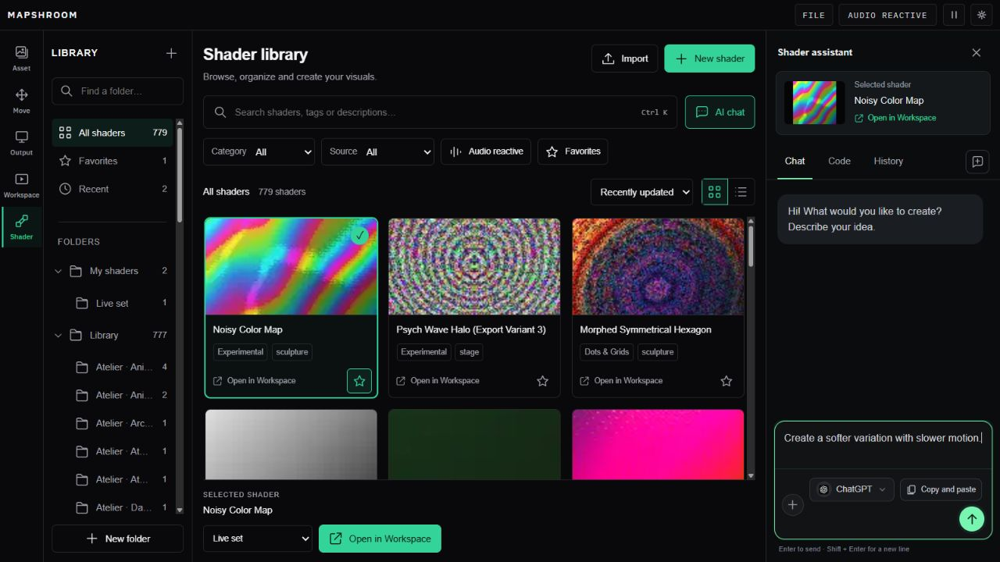
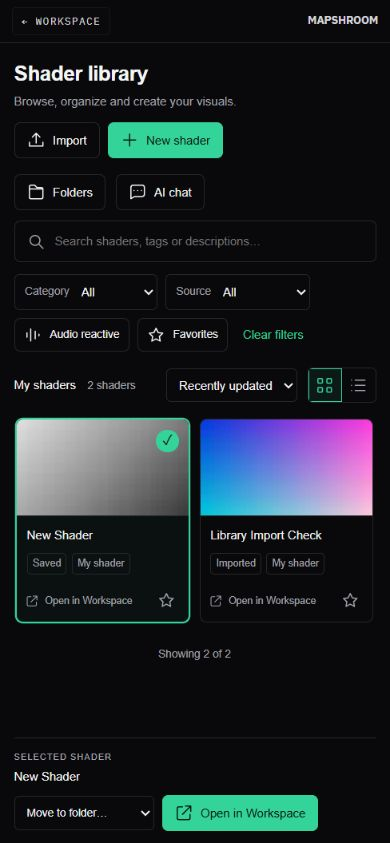

# Shader library

Implemented on `codex/shader-library`, based on `origin/main` at `2eb82aa`.

## Behavior

- Shader appears directly after Workspace in the navigation rail.
- The page uses the real project catalog and existing cached shader thumbnails. Linked timeline drafts are excluded from the catalog to avoid duplicate library entries.
- Search covers names, descriptions, groups and templates. Category, source, audio and favorite filters combine with folder scopes; results support grid/list views, sorting and incremental loading.
- Custom folders, membership and recent selections persist per project in local storage. Favorites share the existing preset browser's storage key. Project autosave persists imported and newly created shaders.
- Import accepts Mapshroom GLSL (`.glsl`, `.frag`, `.fs`, `.txt`) or JSON with `code`, optional `name` and `uniformValues`. The whole batch is parsed and compiled before adding anything; failed imports report the error and preserve the project.
- Open in Workspace is available on every card, in the selection bar and in the chat context. It selects the shader with its saved parameters and shows the Workspace without appending timeline clips. Reopening the current shader preserves its chat history and versions.
- Chat, Code and History reuse the existing Workspace components and provider configuration. Focusing the chat in the library, or in the resulting standalone Workspace preview, keeps the selected shader instead of selecting a playing timeline clip.
- At narrower widths the folder directory becomes a drawer and the chat becomes an overlay. Mobile users can enter through the preset browser's Open shader page action and return with Workspace.

## Validation

- `npm run build`: passed (existing large-chunk notices remain).
- `npm test`: 260 passed, 0 failed.
- Focused final checks: shader library, selection and chat result tests passed.
- ESLint on the new library component/model and changed navigation/preset browser: passed.
- `git diff --check`: passed.
- Browser checks at 1280×720, 1024×768 and 390×844:
  - Search with matching and empty results; combined source/category/audio filters.
  - Favorite toggling, folder creation, moving a shader and list view.
  - Favorites, folder membership, imported shader and new shader survive reload.
  - Invalid import rejected; valid fixture compiled and imported.
  - Imported shader opens with `speed = 0.5`; timeline stays at 8 clips before and after opening.
  - Typing in the library chat and after Open in Workspace keeps the chosen shader.
  - Chat can be closed/reopened with its draft prompt intact; Code shows the selected shader.
  - Folder drawer opens/closes; mobile page has no horizontal overflow; primary actions remain readable.
  - A duplicate React sibling key discovered during QA was fixed by namespacing the library page key.
  - Final verification in a fresh browser tab: no console errors after opening the library, selecting a shader, typing a chat prompt and clearing filters.

No external AI generation or model download was performed during these local checks. Generation uses the existing Workspace provider setup and error handling.

